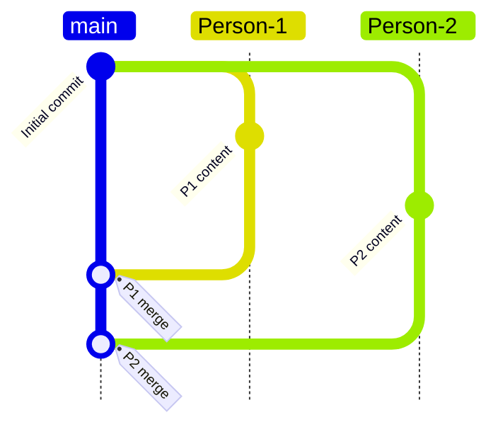

# GitHub 101

**Authors:** [Chinmay Samak](https://www.linkedin.com/in/samakchinmay) and [Tanmay Samak](https://www.linkedin.com/in/samaktanmay)

This guide introduces version control with command-line activities. It builds on the [`Git 101`](Git-101.md) guide, and assumes `git` is installed. Please refer to the official [Git installation guide](https://git-scm.com/install) for more details.

> [!NOTE]
> **Course context:** Autonomous racing teams use Git to track changes to the autonomy stack, simulation configurations, and documentation. GitHub provides a shared platform for reviewing, testing, and integrating the project efficiently.

## Learning goals

By the end of this guide, you should be able to:

- create a Git repository;
- make focused commits;
- connect local repository to GitHub;
- create and work with separate branches;
- merge work across different branches.

## Core mental model

The workflow below shows how two collaborators work on separate branches, publish those branches to GitHub, and merge the completed work into `main`.



`main` is the stable branch. `Person-1` and `Person-2` are isolated working branches that are pushed to GitHub before their changes are merged back into `main`.

## 1. Create a local repository

### Create the repository

```bash
mkdir ~/AUE-X930
cd ~/AUE-X930
git init
```

- `git init` creates a hidden `.git` directory containing the repository's history and configuration. Do not manually edit that directory.

### Add first file

```bash
printf "# Autonomous Racing\n\nPractice repository for the AuE 4930/6930 course.\n" > README.md
git status
```

- `git status` reports your branch and tells you which changes are untracked, modified, or staged.

### Inspect and stage changes

```bash
git diff
git add README.md
git status
git diff --staged
```

- `git diff` shows unstaged changes.
- `git add` selects changes for the next commit.
- `git diff --staged` shows the proposed commit.

### Initial commit

```bash
git commit -m "Initialize practice repository"
git log --oneline
```

A useful commit is small, coherent, and described with an imperative message.

## 2. Connect to GitHub

### Publish the local repository

1. On GitHub, create an empty repository without a `README`, `license`, or `.gitignore`.
2. Copy its URL, e.g., `https://github.com/<YOUR_USERNAME>/AUE-X930.git`.
3. From `~/AUE-X930`, run:

```bash
git remote add origin https://github.com/<YOUR_USERNAME>/AUE-X930.git
git remote -v
git push -u origin main
```

## 3. First branch

A branch is a movable name for a line of commits. Use a branch to isolate a feature or experiment.

```bash
git switch -c Person-1
printf "Person-1 Content\n" > Person-1.txt
git add Person-1.txt
git commit -m "Add content for Person-1"
git push -u origin Person-1
```

## 4. Another branch

At the start of a work session:

```bash
git switch main
git pull --ff-only
git switch -c Person-2
```

While working:

```bash
git status
printf "Person-2 Content\n" > Person-2.txt
git add Person-2.txt
git commit -m "Add content for Person-2"
```

Share the branch:

```bash
git push -u origin Person-2
```

## 5. Merge stable branches to `main`:

```bash
git branch
git switch main
git branch
git merge Person-1
git merge Person-2
git push -u origin main
```

After verifying the merge, delete the local feature branch (optional):

```bash
git branch -d Person-1
git branch -d Person-2
```
