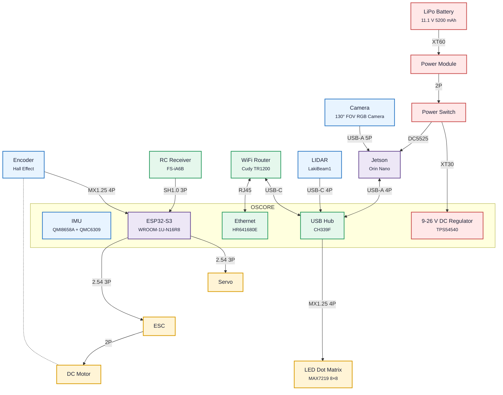
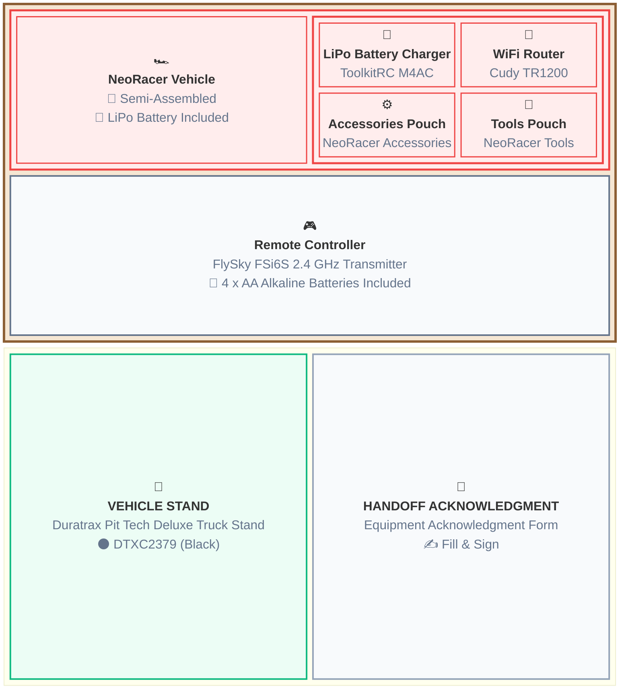

# NeoRacer 101

**Authors:** [Chinmay Samak](https://www.linkedin.com/in/samakchinmay) and [Tanmay Samak](https://www.linkedin.com/in/samaktanmay)

This guide introduces the NeoRacer vehicle architecture and covers the handover, unboxing, setup, installation, and testing instructions (with troubleshooting tips). It assumes working knowledge of Linux, Python, and ROS 2.

> [!NOTE]
> **Course context:** NeoRacer serves as a 1:12 scale reference platform for this course. It integrates onboard compute, sensing (encoder, IMU, camera, and LiDAR), actuation (drive-by-wire and steer-by-wire), and vehicle interfaces into a compact Ackermann-steered 4WD chassis, providing the hardware foundation for autonomous vehicle development.

## Learning goals

By the end of this guide, you should be able to:

- acknowledge the NeoRacer handover;
- unbox and verify the package contents;
- setup the vehicle hardware and interfaces;
- install NeoRacer dependencies and ROS 2 driver;
- test core units and interfaces of the vehicle.

## Core mental model



- All **power** modules are highlighted in $\color{red}{\text{red}}$ color.
- All **sensor** modules are highlighted in $\color{cornflowerblue}{\text{blue}}$ color.
- All **compute** modules are highlighted in $\color{plum}{\text{violet}}$ color.
- All **network** modules are highlighted in $\color{green}{\text{green}}$ color.
- All **actuator** modules are highlighted in $\color{gold}{\text{yellow}}$ color.

## 1. Handover procedure

Each team will be provided with a course equipment package, which includes:
- 1 × NeoRacer vehicle (with 1 × LiPo battery)
- 1 × LiPo battery charger
- 1 × WiFi router
- 1 × tools pouch
- ⁠1 × accessories pouch
- ⁠1 × remote controller (with 4 × AA alkaline batteries)
- 1 × vehicle stand

Each team will return the NeoRacer hardware and associated components to the designated course staff at the end of the semester in substantially the same condition in which they were received. Ordinary wear and tear is expected and will undergo an acceptance review.

Teams may be responsible for any damage, loss, or misuse of the NeoRacer hardware and associated components during the checkout period, subject to applicable course policies.

Each team will sign the [Equipment Acknowledgment Form](Equipment-Acknowledgment-Form.docx) to complete the handover.

## 2. Unbox the course equipment package

Verify the contents of your course equipment package:
- [x] 1 × NeoRacer vehicle (with 1 × LiPo battery)
- [x] 1 × LiPo battery charger
- [x] 1 × WiFi router
- [x] 1 × tools pouch
- [x] ⁠1 × accessories pouch
- [x] ⁠1 × remote controller (with 4 × AA alkaline batteries)
- [x] 1 × vehicle stand

Following is a box-by-box layout of the course equipment package contents:



> [!TIP]
> Refer to the [NeoRacer unboxing guide](https://neobotics.org/docs/getting-started/unbox) to learn more about the contents of the NeoRacer shipment package.

## 3. Setup the vehicle

The very first step to getting started with the vehicle setup is most likely to charge the LiPo battery, since it would have been in "storage" mode with ~3.85 V/cell (about 11.55 V total).

> [!TIP]
> Refer to the [NeoRacer battery charging guide](https://neobotics.org/docs/getting-started/charge-and-power) to learn more about charging the battery.

Once the battery is charged, you can begin the hardware setup:
- Setup the WiFi router (Cudy TR1200)
- Attach antennas to Jetson's Wi-Fi card
- Connect Jetson to power and OSCORE
- Connect the camera and LIDAR cables
- Plug in monitor and keyboard/mouse
- Connect to the internet (WiFi/Ethernet)

> [!TIP]
> Refer to the [NeoRacer vehicle setup guide](https://neobotics.org/docs/getting-started/prepare-the-car) to learn more about setting up the vehicle.

## 4. Install the drivers

Once the hardware is setup, you can install the [`neoracer_ros2_driver`](https://github.com/Neobotics-Foundation-Inc/neoracer_ros2_driver).

- Change directory to `$HOME`:
    ```bash
    cd ~
    ```
- Clone the [`neoracer-installer`](https://github.com/Neobotics-Foundation-Inc/neoracer-installer) repository:
    ```bash
    git clone https://github.com/Neobotics-Foundation-Inc/neoracer-installer.git
    ```    
- Run the `install.sh` shell script (single-command installation):
    > [!IMPORTANT]
    > Unmask the NVIDIA camera service before installing the `neoracer_ros2_driver`:
    > ```bash
    > sudo systemctl unmask nvargus-daemon
    > ```
    ```bash
    bash neoracer-installer/scripts/install.sh
    ```
- Reboot (`group membership`, `udev symlinks`, `racecar services`, etc. only take effect on next boot):
    ```bash
    sudo reboot
    ```

> [!TIP]
> Refer to the [NeoRacer driver installation guide](https://neobotics.org/docs/getting-started/install-driver) to learn more about installing the ROS 2 driver.

## 5. Test the system

Run the `Async Core Test` notebook to check every sensor and control surface on the car and print a pass/fail summary:

- Launch a browser session and go to http://192.168.10.100:8888 to access JupyterLab.

- In the JupyterLab file browser (left pane), go to `neoracer-os` → `labs` → `tests`.

- Open the `test_async_core_real.ipynb` by double-clicking on it.

- Run the notebook by clicking the ▶ button from the toolbar at the top.

- Each test follows a common structure: a title, a short explanation of what is being tested, the code, and the output it prints below. Watch the outputs as they appear.

> [!TIP]
> Refer to the [NeoRacer driver installation guide](https://neobotics.org/docs/getting-started/test-the-system) to learn more about testing the system.

## Tips:

- Smaller screws can be difficult to install, try magnetizing the hex key for ease.

- Once the top platform is disassembled, Jetson WiFi card is accessible from the bottom. You do NOT need to unmount the Jetson carrier board.

- Attach the WiFi antennas to the chassis using zip ties before connecting them to the Jetson Wi-Fi card. This helps them stay in place as you work on connecting them.

- At least for the very first time you boot the vehicle, you will need a monitor with HDMI cable, and a USB keyboard/mouse to work with the vehicle. You can then choose to set up [remote desktop](https://neobotics.org/docs/software/remote-desktop) via the [Cudy router hotspot](https://neobotics.org/docs/getting-started/connect-to-router) or the [Jetson access point](https://neobotics.org/docs/software/networking) for later use.

- Ensure all toggle switches are in TOP position before turning the RC transmitter ON (by long-pressing both the power buttons). Set the position of the speed-mode (left-most) toggle switch as desired: TOP (low-speed), BOTTOM (high-speed). Set the position of the driving-mode (second from left) toggle switch as desired: TOP (autonomous), BOTTOM (manual).

> [!TIP]
> Refer to the [NeoRacer troubleshooting tips](https://neobotics.org/docs/reference/troubleshooting) for more details.

## Safety:

- Operate the vehicle ONLY in open/uncrowded spaces, with at least one dedicated person operating the remote controller for manual override.

- The vehicle speed in autonomous mode is regulated to 6 m/s for safety.

- NEVER leave the vehicle powered unattended.

- Do NOT let your vehicle's LiPo battery reach a state of deep discharge (when its voltage drops below the safe minimum threshold of 3.0 volts per cell). Stop and charge your battery when the vehicle starts making a beeping sound!

- Configure the charger before plugging the battery in for charging.

- ⁠The battery charger is ill-designed, make sure to insert the `balance terminal` (4-pin) correctly (since it can go in either way). Ensure that the negative (black) wire of the `balance terminal` connects to the (-) pin of the charger.

- Adjust the charger voltage to 4.20 V and current to 2.5 A.

- NEVER leave batteries on charging unattended.

- While charging the batteries, make sure to keep the equipment in relatively open/uncrowded spaces and nowhere near any flammable  substances.

- Do NOT charge batteries if you observe any abnormality (puffing, heating, odor, smoke, etc.).

- Do NOT charge the batteries while the discharge terminal is plugged in.

> [!TIP]
> Refer to the [NeoRacer safety procedures](https://neobotics.org/docs/reference/safety) for more details.

## Further reading

- [NeoRacer official website](https://neobotics.org/kits)
- [NeoRacer official documentation](https://neobotics.org/docs)
- [NeoRacer hardware overview](https://neobotics.org/docs/hardware/overview)
- [NeoRacer networking guide](https://neobotics.org/docs/software/networking)
- [NeoRacer remote desktop guide](https://neobotics.org/docs/software/remote-desktop)
- [NeoRacer maintenance schedule](https://neobotics.org/docs/reference/maintenance)
- [NeoRacer frequently asked questions](https://neobotics.org/docs/reference/faq)