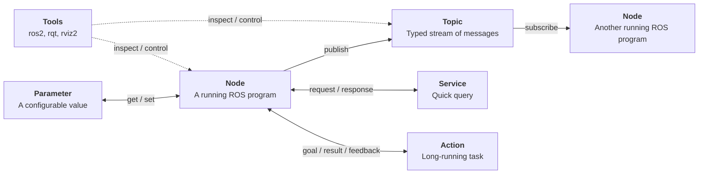

# ROS 101

**Authors:** [Chinmay Samak](https://www.linkedin.com/in/samakchinmay) and [Tanmay Samak](https://www.linkedin.com/in/samaktanmay)

This guide introduces the Robot Operating System 2 (ROS 2) through short, beginner-friendly activities in the official [`ros:humble` Docker image](https://hub.docker.com/layers/library/ros/humble/images/sha256-2a7ca548c7f0f87bc6393ee161dea3283e1c6fa280916f8944b1afadde2d26ec). It builds on the [`Linux-101`](Linux-101.md) and [`Docker-101`](Docker-101.md) guides. It assumes `Ubuntu 22.04`, Docker, and a graphical desktop session. No previous ROS experience is required.

> [!NOTE]
> **Course context:** ROS provides the communication, tooling, and conventions used to assemble autonomous vehicle drivers and software from independent nodes such as perception, localization, planning, control, visualization, etc.

## Learning goals

By the end of this guide, you should be able to:

- work with ROS 2 Humble in a containerized environment;
- explain nodes, topics, services, actions, parameters, and packages;
- start and inspect a ROS 2 system from the command line;
- publish and subscribe to messages;
- use `turtlesim` as a proxy robot simulator;
- visualize ROS nodes and topics with `rqt_graph`;
- inspect data and frames with `rviz2`;
- create and build a basic ROS 2 package;
- launch multiple nodes together with `launch` files;
- save useful data with a `rosbag2`.

## Core mental model



- A **node** is a running program that performs one focused job.
- A **topic** is a named, typed stream of messages. Publishers send messages; subscribers receive them. Topics are used for continuous data streaming.
- A **service** is a short request-and-response interaction. Services are used for quick queries, such as resetting a simulator.
- An **action** is a goal-oriented interaction that can provide feedback while it runs and return a result. Actions are used for long-running tasks, such as navigating to a pose.
- A **parameter** is a configurable value owned by a node.
- A **package** groups ROS 2 code, configuration, launch files, and metadata.
- A **workspace** is a directory containing packages that can be built with `colcon`.
- The **ROS graph** is the set of running nodes and the communication connections between them.

ROS 2 nodes discover one another through [Data Distribution Service (DDS)](https://www.omg.org/omg-dds-portal). For these containerized exercises, `host` networking keeps the container and other ROS processes on the same network `namespace`.

## 1. Prepare the host

This guide uses the official [`ros:humble` Docker image](https://hub.docker.com/layers/library/ros/humble/images/sha256-2a7ca548c7f0f87bc6393ee161dea3283e1c6fa280916f8944b1afadde2d26ec). The `humble` tag is the ROS base image, so the GUI and teaching packages are installed in the container during setup.

Verify that Docker engine is running, pull the required Docker image, and create a workspace directory on the host:

```bash
docker --version
docker pull ros:humble
mkdir -p ~/ros2_ws/src
```

The host directory will be mounted at `/ros2_ws` in the container. Files created there remain after the container is removed.

## 2. Start a ROS 2 Humble container

On a Linux desktop environment using X11 or XWayland, allow local Docker processes to connect to the display:

```bash
xhost local:root
```

Start one reusable container. Run this command from the `home` directory:

```bash
docker run -d --name av-racing-lab \
  --net=host \
  -e DISPLAY="$DISPLAY" \
  -e QT_X11_NO_MITSHM=1 \
  -v /tmp/.X11-unix:/tmp/.X11-unix:rw \
  -v "$PWD/ros2_ws":/ros2_ws \
  ros:humble \
  sleep infinity
```

- `--net=host` makes local ROS 2 discovery straightforward.
- `DISPLAY` and `/tmp/.X11-unix` forward graphical windows to the host.
- `QT_X11_NO_MITSHM=1` avoids a common shared-memory issue with Qt applications in containers.
- The bind mount preserves the workspace on the host.
- `sleep infinity` keeps the container alive.

Open a shell in the container:

```bash
docker exec -it av-racing-lab bash
```

Inside the container, identify the ROS distribution and source its environment:

```bash
echo "$ROS_DISTRO"
printenv | grep -E 'ROS_DISTRO|ROS_VERSION|ROS_DOMAIN_ID'
source /opt/ros/humble/setup.bash
```

> [!TIP]
> Add the `source /opt/ros/humble/setup.bash` line to `~/.bashrc` file to avoid running it every time in a new bash session.
> ```bash
> echo 'source /opt/ros/humble/setup.bash' >> ~/.bashrc
> source ~/.bashrc
> ```

## 3. Install the beginner tools

Install the necessary tools inside the container:

```bash
apt update
apt install -y \
  nano \
  python3-colcon-common-extensions \
  ros-humble-demo-nodes-cpp \
  ros-humble-demo-nodes-py \
  ros-humble-turtlesim \
  ros-humble-rqt \
  ros-humble-rqt-common-plugins \
  ros-humble-rqt-graph \
  ros-humble-rviz2
```

Verify some important packages:

```bash
ros2 pkg executables turtlesim
ros2 pkg executables rqt_graph
ros2 pkg executables rviz2
```

> [!TIP]
> Package installation changes only the running container. For a repeatable team environment, put these commands in a `Dockerfile` to build containers.

## 4. Run the publisher/subscriber demo

We will now run a simple talker and listener demo using ROS 2. Open two host terminals and enter the container in each of them:

```bash
docker exec -it av-racing-lab bash
```

In the first terminal session, start the publisher:

```bash
ros2 run demo_nodes_cpp talker
```

In the second terminal session, start the subscriber:

```bash
ros2 run demo_nodes_py listener
```

While the talker is running, inspect the processes from a third shell:

```bash
ros2 node list
ros2 topic list
ros2 topic info /chatter
ros2 topic echo /chatter
ros2 topic hz /chatter
```

Stop either program with `Ctrl`+`C`.

## 5. Drive a simulated turtle with `turtlesim`

`turtlesim` is a lightweight proxy robot simulator designed for learning ROS concepts.

In one container shell, start the simulator:

```bash
ros2 run turtlesim turtlesim_node
```

A simulator window should appear on the host.

In another shell, start keyboard teleoperation interface:

```bash
ros2 run turtlesim turtle_teleop_key
```

With the terminal session running the `teleop` interface as the current context, use the arrow keys to move the turtle.

Inspect the ROS 2 `topics`:

```bash
ros2 topic list
ros2 topic echo /turtle1/pose
```

In a third shell, publish a velocity command directly for five seconds:

```bash
ros2 topic pub --rate 10 /turtle1/cmd_vel geometry_msgs/msg/Twist \
  "{linear: {x: 2.0}, angular: {z: 1.0}}" \
  --times 50
```

Inspect the ROS 2 `nodes`:

```bash
ros2 node list
ros2 node info /turtlesim
ros2 node info /teleop_turtle
```

## 6. Work with ROS `services`, `actions`, and `parameters`

Keep `turtlesim_node` and `turtle_teleop_key` running.

In another container shell, list the ROS 2 `services` currently active in the system:

```bash
ros2 service list
ros2 service list -t
```

> [!NOTE]
> The `-t` (or `--show-types`) will list services along with their `type`.

Use the `reset` service to reset `turtlesim`:

```bash
ros2 service type /reset
ros2 service call /reset std_srvs/srv/Empty {}
```

Use the `spawn` service to spawn a new turtle in `turtlesim`:

```bash
ros2 service type /spawn
ros2 interface show turtlesim/srv/Spawn
ros2 service call /spawn turtlesim/srv/Spawn "{x: 2, y: 2, theta: 0.2, name: ''}"
```

> [!NOTE]
> The first section of the `ros2 interface show` output for a `service`, above the `---`, is the structure (data type and name) of the `request`. The next section is the structure of the `response`.

Now, list the ROS 2 `actions` currently active in the system:

```bash
ros2 action list
ros2 action list -t
```

> [!NOTE]
> The `-t` (or `--show-types`) will list actions along with their `type`.

Use the `/turtle1/rotate_absolute` action to command `turtlesim`:

```bash
ros2 action info /turtle1/rotate_absolute
ros2 interface show turtlesim/action/RotateAbsolute
ros2 action send_goal /turtle1/rotate_absolute turtlesim/action/RotateAbsolute "{theta: 1.57}" --feedback
```

> [!NOTE]
> The first section of the `ros2 interface show` output for an `action`, above the `---`, is the structure (data type and name) of the `goal` request. The next section is the structure of the `result`. The last section is the structure of the `feedback`.

Now, list the ROS 2 `parameters` belonging to the various nodes:

```bash
ros2 param list
```

Find out the current value of `/turtlesim`'s `background_r` parameter:

```bash
ros2 param get /turtlesim background_r
```

View all of a node’s current parameter values:

```bash
ros2 param dump /turtlesim
```

Change a parameter’s value at runtime:

```bash
ros2 param set /turtlesim background_r 150
```

Save/load parameters to/from a file of a currently running node:

```bash
ros2 param dump /turtlesim > turtlesim.yaml
nano turtlesim.yaml
ros2 param load /turtlesim turtlesim.yaml
```

## 7. Visualize the ROS graph with `rqt`

Keep `turtlesim_node` and `turtle_teleop_key` running. In another container shell, run:

```bash
rqt_graph
```

You should see nodes and their topic connections. If the window is blank, wait briefly for discovery, then select **Nodes/Topics (all)** and refresh.

You can also start the same tool with:

```bash
rqt
```

Then choose **Plugins > Introspection > Node Graph**.

The graph should show `/teleop_turtle` node publishing velocity commands to `/turtle1/cmd_vel` topic and `/turtlesim` node subscribing to them. Use the graph to connect what you see in the GUI to the command-line output from `ros2 node list` and `ros2 topic list`.

> [!NOTE]
> There are many other useful `rqt` tools apart from `rqt_graph`. These include `rqt_publisher`, `rqt_image`, etc.

## 8. Visualize and inspect data with `rviz2`

Start a static transform publisher in one shell:

```bash
ros2 run tf2_ros static_transform_publisher \
  --x 1 --y 0 --z 0 --yaw 0 --pitch 0 --roll 0 \
  --frame-id map --child-frame-id vehicle
```

Start RViz 2 in another shell:

```bash
rviz2
```

In RViz 2, set **Global Options > Fixed Frame** to `map`, add a **TF** display, and expand the tree. You should see the relationship between `map` and `vehicle`.

> [!NOTE]
> RViz 2 is a visualization tool. It subscribes to ROS topics and displays data such as robot models, coordinate frames, laser scans, camera images, maps, paths, etc.

> [!TIP]
> A real autonomous vehicle may publish frames such as `map`, `odom`, `base`, `laser`, `camera`, etc. Consistent frame names and transforms are essential when combining data from various frames of references (e.g. using sensor data with a vehicle model for estimation/tracking).

## 9. Create a simple ROS 2 package

Create a package in the mounted workspace:

```bash
cd /ros2_ws/src
ros2 pkg create --build-type ament_python av_racing_lab --dependencies rclpy std_msgs
```

Create a simple node `lap_publisher` that keeps publishing incremental lap counts:

```bash
nano av_racing_lab/av_racing_lab/lap_publisher.py
```

Paste the following code, save with `Ctrl`+`O`, press `Enter`, and exit with `Ctrl`+`X`:

```python
import rclpy
from rclpy.node import Node
from std_msgs.msg import String


class LapPublisher(Node):
    def __init__(self):
        super().__init__("lap_publisher")
        self.publisher = self.create_publisher(String, "lap_status", 10)
        self.lap = 0
        self.timer = self.create_timer(2.0, self.publish_status)

    def publish_status(self):
        self.lap += 1
        message = String()
        message.data = f"Completed practice lap {self.lap}"
        self.publisher.publish(message)
        self.get_logger().info(message.data)


def main(args=None):
    rclpy.init(args=args)
    node = LapPublisher()
    rclpy.spin(node)
    node.destroy_node()
    rclpy.shutdown()


if __name__ == "__main__":
    main()
```

Register the executable in `av_racing_lab/setup.py` by adding this entry inside `console_scripts` list of `entry_points`:

```bash
nano av_racing_lab/setup.py
```

```python
        "lap_publisher = av_racing_lab.lap_publisher:main",
```

Build and source the workspace:

```bash
cd /ros2_ws
colcon build --symlink-install
source install/setup.bash
ros2 run av_racing_lab lap_publisher
```

In another shell, source the workspace and listen to the topic:

```bash
source /ros2_ws/install/setup.bash
ros2 topic echo /lap_status
```

> [!TIP]
> `source /ros2_ws/install/setup.bash` is required in a new shell before that shell can find packages built in the workspace. Add it to the `~/.bashrc` like we did for automatically sourcing the ROS 2 environment.
> ```bash
> echo 'source /ros2_ws/install/setup.bash' >> ~/.bashrc
> source ~/.bashrc
> ```

## 10. Launch multiple nodes together with `launch` files

Create a `launch` directory and a `launch` file:

```bash
mkdir -p /ros2_ws/src/av_racing_lab/launch
nano /ros2_ws/src/av_racing_lab/launch/demo.launch.py
```

Paste the following contents within the `launch` file:

```python
from launch import LaunchDescription
from launch_ros.actions import Node


def generate_launch_description():
    return LaunchDescription([
        Node(
            package="av_racing_lab",
            executable="lap_publisher",
            name="lap_publisher",
        ),
        Node(
            package="demo_nodes_py",
            executable="listener",
            name="lap_listener",
            remappings=[("chatter", "lap_status")],
        ),
    ])
```

This launch file launches the `lap_publisher` executable (node) from the `av_racing_lab` package with `lap_publisher` name. It also launches the `listener` executable (node) from the `demo_nodes_py` package with `lap_listener` name, and remaps the default topic `chatter` to use `lap_status` instead.

Add the launch file to the `data_files` list in `setup.py`:

```bash
cd src/
nano av_racing_lab/setup.py
```

```python
        ("share/av_racing_lab/launch", ["launch/demo.launch.py"]),
```

Then rebuild the package and launch the nodes together:

```bash
cd /ros2_ws
colcon build --symlink-install
source install/setup.bash
ros2 launch av_racing_lab demo.launch.py
```

`ros2 launch` is useful when a vehicle system needs many nodes, parameters, remappings, or other processes started in a repeatable way.

## 11. Record and replay data with `rosbag2`

Make sure that the `lap_publisher` from the previous activity is running (or re-start it), then record the `/lap_status` topic:

```bash
cd /ros2_ws
ros2 bag record -o av-racing-lab.bag /lap_status
```

> [!NOTE]
> The `-o` allows user to specify a custom name. There are other options to the `ros2 bag record` command, e.g., `-a` to record all topics instead of manually specification.

Let the `bag record` process run for a few seconds and press `Ctrl`+`C` to stop recording (users can also pause/resume recording).

Inspect the recorded data:

```bash
ros2 bag info av-racing-lab.bag
ros2 bag play av-racing-lab.bag
```

In another shell, run `ros2 topic echo /lap_status` while the bag plays.

> [!NOTE]
> ROS bags are useful for replaying data without repeatedly driving the vehicle or simulator, and are a great way of detecting, debugging, and documenting autonomous system behaviors.

Files from a running Docker container can be copied to the host using `docker cp` command:
```bash
docker cp av-racing-lab:/ros2_ws/av-racing-lab.bag /home/<USERNAME>
```

## 12. Stop and clean up

Stop individual ROS programs with `Ctrl`+`C`. When finished with the container:

```bash
docker stop av-racing-lab
```

The stopped container and the mounted `/ros2_ws` directory preserve your work. When you are certain you no longer need this practice container, remove it:

```bash
docker rm av-racing-lab
```

The workspace on the host is not removed by `docker rm`. Review Docker resources before removing images or volumes:

```bash
docker ps -a
docker image ls ros
docker system df
```

## Compact command reference

| Task | Command |
|---|---|
| Source ROS 2 | `source /opt/ros/humble/setup.bash` |
| Source a workspace | `source /<PATH/TO/ROS2_WS>/install/setup.bash` |
| List nodes | `ros2 node list` |
| Inspect a node | `ros2 node info <NODE>` |
| List topics | `ros2 topic list [-t]` |
| Inspect a topic | `ros2 topic info <TOPIC>` |
| Display a topic | `ros2 topic echo <TOPIC>` |
| Publish a message | `ros2 topic pub <TOPIC> <TYPE> <VALUE>` |
| List services | `ros2 service list [-t]` |
| Inspect a service | `ros2 service type <SERVICE>` |
| Call a service | `ros2 service call <SERVICE> <TYPE> <VALUE>` |
| List actions | `ros2 action list [-t]` |
| Inspect an action | `ros2 action info <ACTION>` |
| Send an action goal | `ros2 action send_goal <ACTION> <TYPE> <VALUE> [--feedback]` |
| List parameters | `ros2 param list` |
| Get a parameter | `ros2 param get <NODE> <PARAMETER>` |
| Set a parameter | `ros2 param set <NODE> <PARAMETER> <VALUE>` |
| Inspect an interface | `ros2 interface show <PACKAGE>/<TYPE>/<INTERFACE>` |
| List packages | `ros2 pkg list` |
| Run an executable | `ros2 run <PACKAGE> <EXECUTABLE>` |
| Launch a system | `ros2 launch <PACKAGE> <FILE>` |
| Build a workspace | `colcon build [--symlink-install]` |
| Visualize graph | `rqt_graph` |
| Visualize data | `rviz2` |
| Record a topic | `ros2 bag record <TOPIC>` |
| Record all topics | `ros2 bag record -a` |
| Play a bag | `ros2 bag play <BAG DIRECTORY>` |

## Common mistakes

- **`ros2: command not found`**: run `source /opt/ros/humble/setup.bash` in the current shell.
- **`Package '<NAME>' not found`**: source `/ros2_ws/install/setup.bash` after building, and verify the package name with `ros2 pkg list`.
- **GUI window does not appear**: confirm `echo "$DISPLAY"`, check that `/tmp/.X11-unix` exists on the host, rerun the `xhost` command, and verify the container was started with the display arguments.
- **`rviz2` or `rqt_graph` is missing**: install the packages; `ros:humble` is not the full desktop image.
- **Nodes cannot discover one another**: make sure all shells use the same `ROS_DOMAIN_ID`, use `--net=host`, and avoid mixing unrelated ROS domains.
- **A topic appears empty**: check that a publisher is running, that the topic name and message type are correct, and that the QoS settings are compatible.
- **A package is not found**: rebuild with `colcon build`, source `/ros2_ws/install/setup.bash`, and check the `setup.py` entry point spelling.
- **The terminal appears frozen**: you may be inside `rqt`, `rviz2`, `less`, or a running ROS process. Close the GUI, press `q` where appropriate, or use `Ctrl`+`C`.
- **Files seem to disappear**: files written outside `/ros2_ws` are inside the container layer. Store code and data in the bind-mounted workspace or copy manually before removing the container.
- **`xhost` feels unsafe**: avoid broad commands such as `xhost +`; this guide grants access only to the local root user used by the container and revokes it during cleanup.

## Further reading

- [ROS 2 Humble official installation guide](https://docs.ros.org/en/humble/Installation.html)
- [ROS 2 Humble installation video (by Chinmay & Tanmay)](https://youtu.be/rtrFs9aUxCU)
- [ROS 2 Humble official documentation](https://docs.ros.org/en/humble)
- [ROS 2 Humble official tutorials](https://docs.ros.org/en/humble/Tutorials.html)